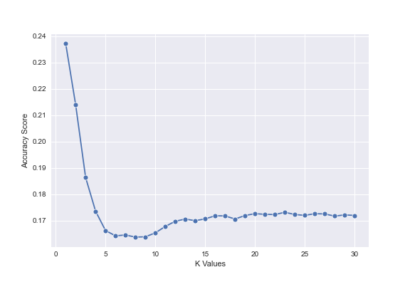

# Music Prediction
### I see my life in terms of music - Albert Einstein

Using Billboard top 100 from 2000 to 2019 and spotify hit predictor dataset, predict which factors makes music as a hit. The model will predict whether the music can be a hit with the accuracy of 94%

 

  

## Overview

1. Business Understanding
2. Data Understadning
3. Modeling
4. Evaluation
5. Conclusion
7. Repository

 

## 1. Business Understanding
"In the music market, superstars significantly dominate the market share, while predicting the top hit songs is notoriously difficult" according to Seon Tae Kin and Joo Hee Oh. (*Music Intelligence: Granular Data and Prediction of Top Ten Hit Songs*)  

In modern society, people often assume that famous star’s music is one of the most important factors of deciding whether music could be a hit. But there are many other factors of deciding whether music could be a hit such as tempo, energy, danceability, and number of weeks on chart (billboard).  
Knowing the important factor could help industry to predict which music could be a bigger hit which will help industry to make most advantageous entry point into the market.

 

## 2. Data Understadning

Two datas are used:  

1. Billboard top 100
Basic music list that considered as a hit
The original data were from 1990s to 2019. To increase the reliability of data, used data from 2000 to 2019
Because the data was too big, drop unnecessary information such as uri, writing credits, and lyrics.
Also, split the data in to two different groups: 2000 to 2009, 2010 to 2019.
https://www.kaggle.com/datasets/danield2255/data-on-songs-from-billboard-19992019 

2. Sportify Hit predictor Dataset
Data with extra features and components of the music
The dataset is from 1960 to 2019. To increase the reliability and combine with first data, only use data from 2000 to 2019
Drop unnecessary information and duplicate columns
https://www.kaggle.com/datasets/theoverman/the-spotify-hit-predictor-dataset?select=dataset-of-00s.csv

 

 

## 3. Modeling

Three differnt model is used.
To find the basic relationship with each components of dataset, use multiple linear regression model.

As the baseline, use K-fold cross validation. Depends on the parameter, accuracy sometimes goes higher, but most of the time, accuracy stays under 25 percent

 

 

For the final model, used Decision Tree Classifier. Accuracy is 93.96 percent. With different parameter, accuracy can go to 89 percent. It is not overfitting, and clearly, it is not underfitting.

 

 

## 4. Evaluation

Baseline model, or the K-fold cross validation is extreme underfitting, and it cannot be used in reality. But on the other hand, the decision tree classifier's accuracy is a lot higher than K-fold cross validation, and it can be used in reality.  

 

 

But as it is shown in plot, it has an efficiency problem. There are too many components in the model that it is inefficient.

 

## 5. Conclusion

Because the decision tree classifier has an efficiency problem, it is recommended to create different types of group for data. Also, it is recommended to find the components of music that has is more essential to increase efficiency such as energy or danceability.

 

## 7. Repository

When coding, created dataInit file to initialize data. It clean and merged data with simple visualization.  
Visual1.ipynb file has multiple linear regression model with simple visualization.  
Visual 2 has an K-fold with decision tree models. It also has some different parameters and different visualization which could be ignored.  
Most coding is referencing to lectures from Flatiron AI Academy, not only from apprentiship, but also intensive section  

In sum, all codes that were actually used for the final modeling is combined in a single file called MusicPrediction.ipynb

 

Data:  
data folder is https://github.com/GitSarYun/musicPrediction/tree/main/data

ziped data from billboard top 100 from 2000 to 2019: https://github.com/GitSarYun/musicPrediction/blob/main/data/billboardHot100_1999-2019.csv.zip

Sportify Hit predictor Dataset:  
2000 to 2009: https://github.com/GitSarYun/musicPrediction/blob/main/data/dataset-of-00s.csv
2010 to 2019: https://github.com/GitSarYun/musicPrediction/blob/main/data/dataset-of-10s.csv

merged data from 2000 to 2009: https://github.com/GitSarYun/musicPrediction/blob/main/data/df_00.csv
merged data from 2010 to 2019: https://github.com/GitSarYun/musicPrediction/blob/main/data/df_10.csv

   

Sara Yun  
Flatiron Apprenticeship AI Academy Capstone
